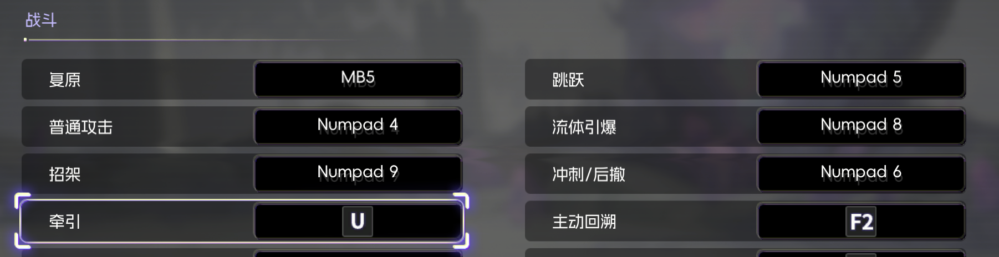

# KotamaAcademyCitadel Numpad / Mouse Side Button Bind Patch (IL2CPP / BepInEx6)

[中文说明](README.md)

This repository provides a **BepInEx IL2CPP plugin** for *KotamaAcademyCitadel* to:

- enable **numpad** key rebinding, and
- enable **mouse side button** rebinding (`MB4` / `MB5`),

while keeping the in-game keybind UI stable (text fallback when icon resources are missing).

## Features

- Bind numpad keys: `Numpad 0-9`, `Numpad * / + -`, `Numpad Enter`, etc.
- Bind mouse side buttons: `MB4` / `MB5` (InputSystem `<Mouse>/backButton` / `<Mouse>/forwardButton`).
- Preserves the game's conflict/swap logic by keeping `PressTxt` as a logical control path (e.g. `<Keyboard>/numpad4`).
- Uses safe text-only UI display to avoid getting stuck in “press any key” / missing icon issues.

## Requirements

- KotamaAcademyCitadel (Unity 2022.3, IL2CPP)
- **BepInEx 6 (IL2CPP build)**
  - Download / 下载: https://github.com/BepInEx/BepInEx/releases
  - Make sure you download the `Unity.IL2CPP` package for your platform (e.g. Windows x64 IL2CPP zip).

## Install

1. Install BepInEx 6 (IL2CPP).
2. Get the plugin DLL (build it yourself or use your local build): `Kotama.NumpadRebind.dll`.
3. Copy it to: `KotamaAcademyCitadel\BepInEx\plugins\Kotama.NumpadRebind.dll`
4. Launch the game.

## Build (recommended)

This project references `BepInEx/core` and `BepInEx/interop` assemblies via relative paths, so the easiest setup is keeping this repo under the game folder.

Example:

1. Place/clone the repo into:
   - `...\KotamaAcademyCitadel\Modding\kotama_numpad_bind_patch\`
2. Build:
   - `dotnet build .\kotama_numpad_bind_patch\KotamaNumpadRebind.csproj -c Release`
3. Output:
   - `.\kotama_numpad_bind_patch\bin\Release\net6.0\Kotama.NumpadRebind.dll`

## Troubleshooting

### Settings menu missing / keybind settings corrupted

Force-quitting the game (e.g. `Alt+F4`) while the keybind UI is waiting for input may interrupt the settings override write, causing the keybind/settings menu to disappear.

You can safely reset *only* the settings/keybind overrides (without touching your save progress) by removing/renaming:

- `C:\Users\<username>\AppData\LocalLow\AtomStringCompany\KotamaAcademyCitadel\<steamid>\settings.json`

Steps:

1. Exit the game.
2. Rename `settings.json` to `settings.json.bak` (or delete it).
3. Launch the game again — it will regenerate a fresh settings file.

## Notes

- Implementation notes live in `IMPLEMENTATION_MEMO.md`.
- This repo does not include any game files, BepInEx files, or build outputs.

